# Grafana dashboards
This repository showcases custom Grafana dashboards for monitoring and visualizing key metrics in various areas.

Those are also published on [grafana.com](https://grafana.com/dashboards)

## Prometheus datasource

Set of Prometheus Grafana dashboards published on
[grafana.com](https://grafana.com/dashboards?dataSource=prometheus)

### [ElasticSearch](https://github.com/arnaudlemaignen/grafana-dashboards/tree/master/prometheus-ds/elasticsearch)
This dashboard needs the [elasticsearch exporter](https://github.com/prometheus-community/elasticsearch_exporter) and the [elasticsearch query exporter](https://github.com/braedon/prometheus-es-exporter) to be scraped.
[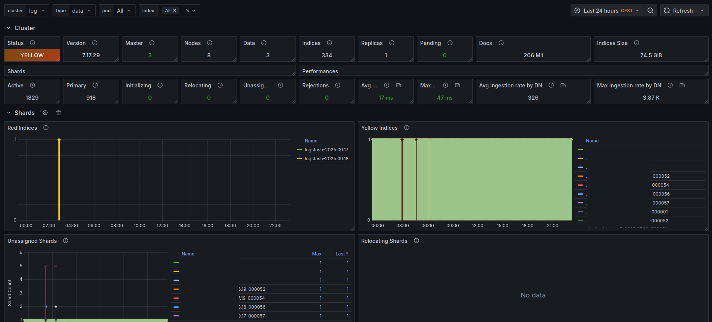](https://github.com/arnaudlemaignen/grafana-dashboards/tree/master/prometheus-ds/elasticsearch)

### [Grafana](https://github.com/arnaudlemaignen/grafana-dashboards/tree/master/prometheus-ds/grafana)
This dashboard needs grafana metrics endpoint to be scraped.
```
- job_name: 'grafana-exporter'
  static_configs:
    -  targets: ['grafana:3000']

```
[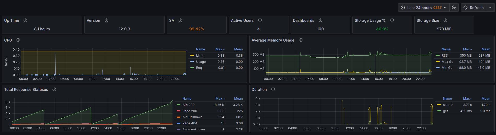](https://github.com/arnaudlemaignen/grafana-dashboards/tree/master/prometheus-ds/grafana)

### [Kafka](https://github.com/arnaudlemaignen/grafana-dashboards/tree/master/prometheus-ds/kafka)
This dashboard needs [kafka exporter](https://github.com/danielqsj/kafka_exporter) and the JMX agent to be activated and scraped.
[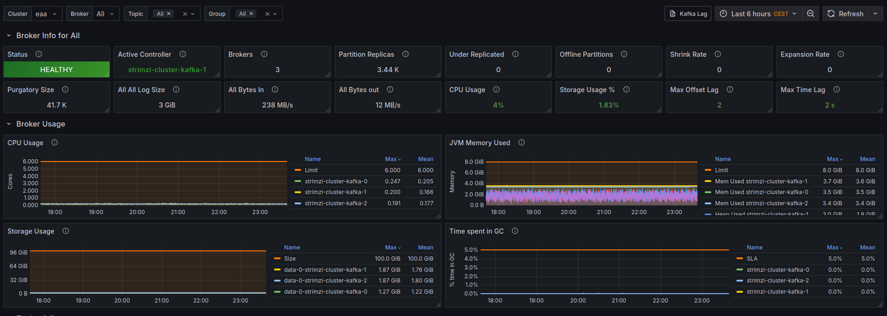](https://github.com/arnaudlemaignen/grafana-dashboards/tree/master/prometheus-ds/kafka)

### [Logstash](https://github.com/arnaudlemaignen/grafana-dashboards/tree/master/prometheus-ds/logstash)
This dashboard needs the [logstash exporter](https://github.com/leroy-merlin-br/logstash-exporter) to be scraped.
[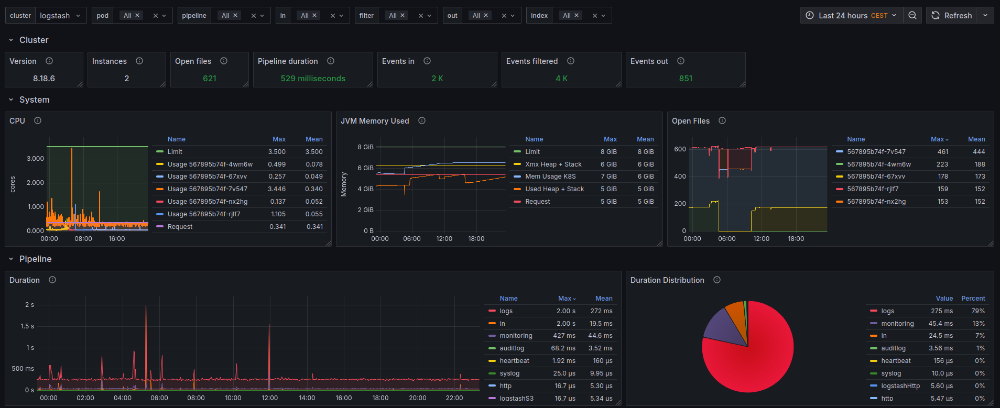](https://github.com/arnaudlemaignen/grafana-dashboards/tree/master/prometheus-ds/logstash)

### [Nodes](https://github.com/arnaudlemaignen/grafana-dashboards/tree/master/prometheus-ds/nodes)
This dashboard needs the node-exporter metrics to be scraped.

Below is the node-exporter args
```
"/bin/node_exporter","--no-collector.arp","--no-collector.bcache","--no-collector.bonding","--no-collector.btrfs","--no-collector.conntrack","--no-collector.edac","--no-collector.entropy","--no-collector.filefd","--no-collector.hwmon","--no-collector.infiniband","--no-collector.ipvs","--no-collector.mdadm","--no-collector.powersupplyclass","--no-collector.pressure","--no-collector.rapl","--no-collector.schedstat","--no-collector.sockstat","--no-collector.softnet","--no-collector.textfile","--no-collector.thermal_zone","--no-collector.timex","--no-collector.udp_queues","--no-collector.uname","--no-collector.xfs","--no-collector.zfs","--collector.processes"
```
[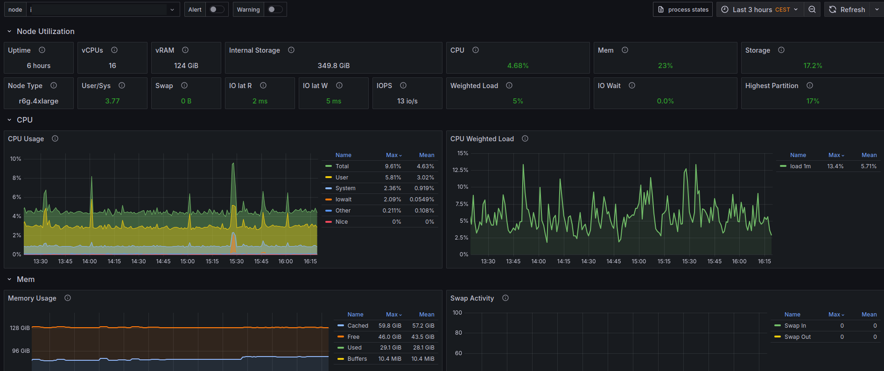](https://github.com/arnaudlemaignen/grafana-dashboards/tree/master/prometheus-ds/nodes)

### [Nodes TOP](https://github.com/arnaudlemaignen/grafana-dashboards/tree/master/prometheus-ds/nodes-top)
This dashboard needs the node-exporter metrics to be scraped.

Below is the node-exporter args
```
"/bin/node_exporter","--no-collector.arp","--no-collector.bcache","--no-collector.bonding","--no-collector.btrfs","--no-collector.conntrack","--no-collector.edac","--no-collector.entropy","--no-collector.filefd","--no-collector.hwmon","--no-collector.infiniband","--no-collector.ipvs","--no-collector.mdadm","--no-collector.powersupplyclass","--no-collector.pressure","--no-collector.rapl","--no-collector.schedstat","--no-collector.sockstat","--no-collector.softnet","--no-collector.textfile","--no-collector.thermal_zone","--no-collector.timex","--no-collector.udp_queues","--no-collector.uname","--no-collector.xfs","--no-collector.zfs","--collector.processes"
```
[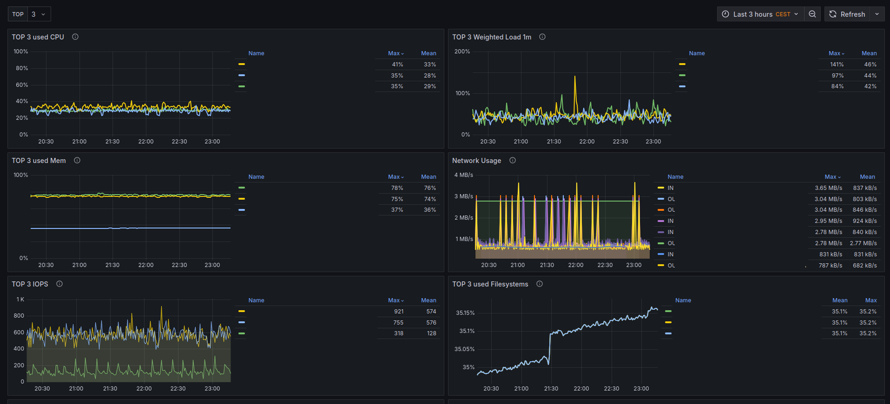](https://github.com/arnaudlemaignen/grafana-dashboards/tree/master/prometheus-ds/nodes-top)

### [Pod Node Issues](https://github.com/arnaudlemaignen/grafana-dashboards/tree/master/prometheus-ds/pod-node-issues)
This dashboard needs the [kube state metrics](https://github.com/kubernetes/kube-state-metrics) to be scraped.
[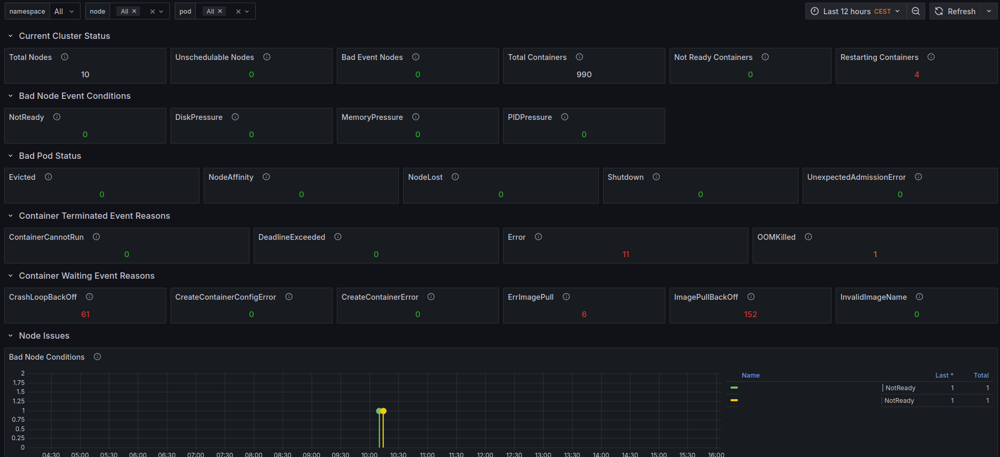](https://github.com/arnaudlemaignen/grafana-dashboards/tree/master/prometheus-ds/pod-node-issues)

### [Pods](https://github.com/arnaudlemaignen/grafana-dashboards/tree/master/prometheus-ds/pods)
This dashboard needs the [kube state metrics](https://github.com/kubernetes/kube-state-metrics) to be scraped.
[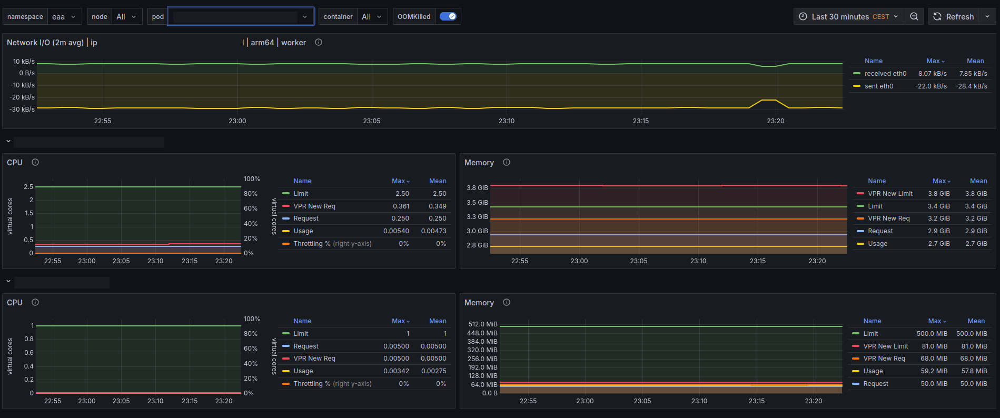](https://github.com/arnaudlemaignen/grafana-dashboards/tree/master/prometheus-ds/pods)

### [Pods Java](https://github.com/arnaudlemaignen/grafana-dashboards/tree/master/prometheus-ds/pods-java)
This dashboard needs the JMX agent to be activated and scraped in all Java containers.
[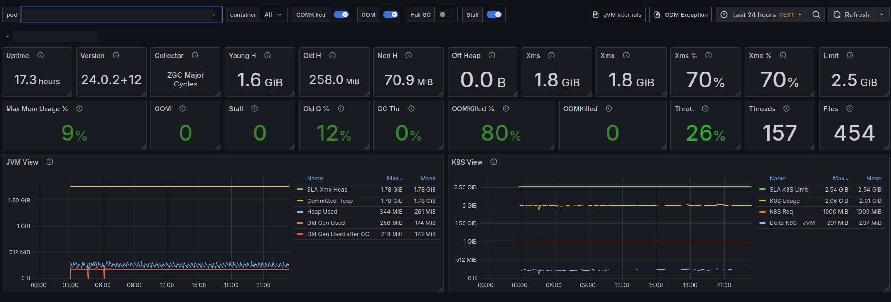](https://github.com/arnaudlemaignen/grafana-dashboards/tree/master/prometheus-ds/pods-java)

### [Pods TOP](https://github.com/arnaudlemaignen/grafana-dashboards/tree/master/prometheus-ds/pods-top)
This dashboard needs the [kube state metrics](https://github.com/kubernetes/kube-state-metrics) to be scraped.
[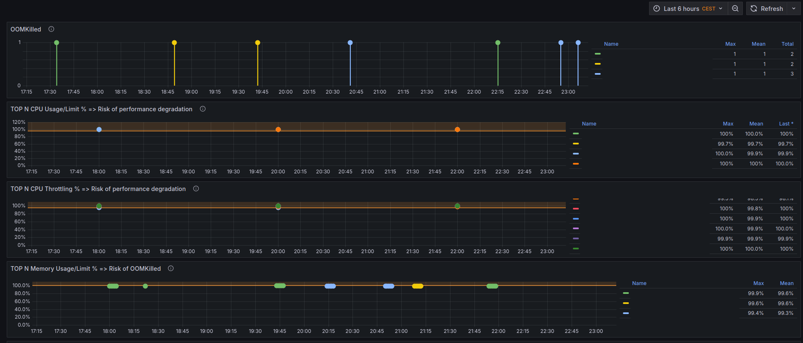](https://github.com/arnaudlemaignen/grafana-dashboards/tree/master/prometheus-ds/pods-top)

### [Prometheus](https://github.com/arnaudlemaignen/grafana-dashboards/tree/master/prometheus-ds/prometheus)
This dashboard needs prometheus metrics endpoint to be scraped.
```
- job_name: 'prometheus'
  static_configs:
    - targets: ['prometheus:8080']
```
[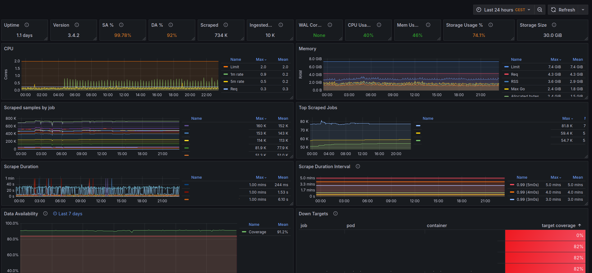](https://github.com/arnaudlemaignen/grafana-dashboards/tree/master/prometheus-ds/prometheus)

### [Prometheus AlertManager](https://github.com/arnaudlemaignen/grafana-dashboards/tree/master/prometheus-ds/alertmanager)
This dashboard needs prometheus alertmanager metrics endpoint to be scraped.
```
- job_name: 'prometheus-am'
  static_configs:
    - targets: ['prometheus-alertmanager:8080']
```
[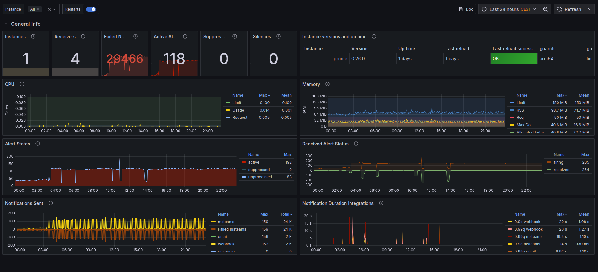](https://github.com/arnaudlemaignen/grafana-dashboards/tree/master/prometheus-ds/alertmanager)

### [PVC](https://github.com/arnaudlemaignen/grafana-dashboards/tree/master/prometheus-ds/pvc)
This dashboard is using the kubelet metrics
[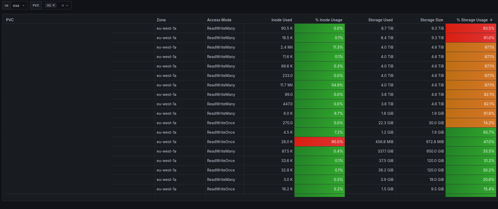](https://github.com/arnaudlemaignen/grafana-dashboards/tree/master/prometheus-ds/pvc)

### [Redis](https://github.com/arnaudlemaignen/grafana-dashboards/tree/master/prometheus-ds/redis)
This dashboard needs the [redis exporter](https://github.com/oliver006/redis_exporter) to be scraped.
[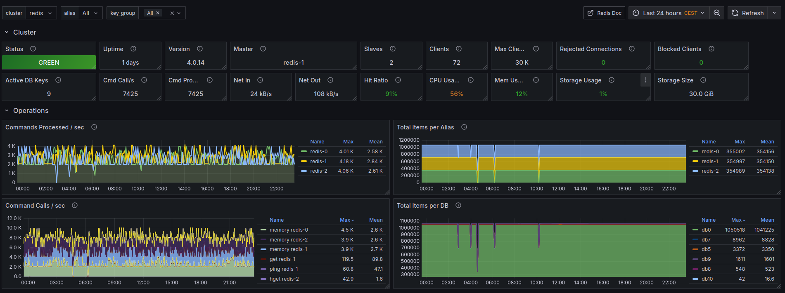](https://github.com/arnaudlemaignen/grafana-dashboards/tree/master/prometheus-ds/redis)

### [VPR](https://github.com/arnaudlemaignen/grafana-dashboards/tree/master/prometheus-ds/vpr)
This dashboard needs the [VPR exporter](https://github.com/arnaudlemaignen/vpr-exporter) to be running and scraped.
[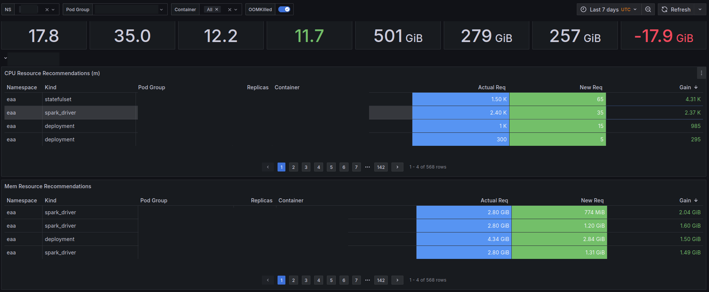](https://github.com/arnaudlemaignen/grafana-dashboards/tree/master/prometheus-ds/vpr)

### [Zookeeper](https://github.com/arnaudlemaignen/grafana-dashboards/tree/master/prometheus-ds/zookeeper)
This dashboard needs the JMX agent to be activated and scraped.
[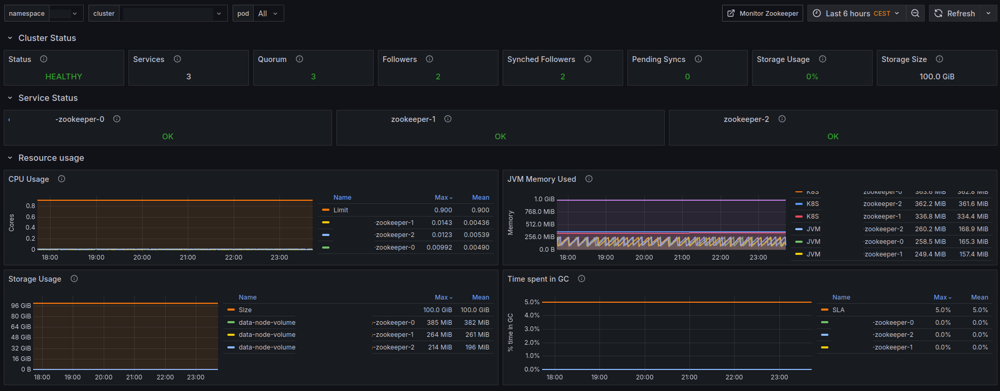](https://github.com/arnaudlemaignen/grafana-dashboards/tree/master/prometheus-ds/zookeeper)


## AWS CloudWatch datasource

Set of AWS Grafana dashboards published on
[grafana.com](https://grafana.com/dashboards?dataSource=cloudwatch)

Here is an example of IAM role for Grafana to use those dashboards:

```
{
    "Version": "2012-10-17",
    "Statement": [
        {
            "Sid": "AllowReadingMetricsFromCloudWatch",
            "Effect": "Allow",
            "Action": [
                "cloudwatch:DescribeAlarmsForMetric",
                "cloudwatch:DescribeAlarmHistory",
                "cloudwatch:DescribeAlarms",
                "cloudwatch:ListMetrics",
                "cloudwatch:GetMetricData",
                "cloudwatch:GetInsightRuleReport"
            ],
            "Resource": "*"
        },
        {
            "Sid": "AllowReadingLogsFromCloudWatch",
            "Effect": "Allow",
            "Action": [
                "logs:DescribeLogGroups",
                "logs:GetLogGroupFields",
                "logs:StartQuery",
                "logs:StopQuery",
                "logs:GetQueryResults",
                "logs:GetLogEvents"
            ],
            "Resource": "*"
        },
        {
            "Sid": "AllowReadingTagsInstancesRegionsFromEC2",
            "Effect": "Allow",
            "Action": [
                "ec2:DescribeTags",
                "ec2:DescribeInstances",
                "ec2:DescribeRegions"
            ],
            "Resource": "*"
        },
        {
            "Sid": "AllowReadingResourcesForTags",
            "Effect": "Allow",
            "Action": "tag:GetResources",
            "Resource": "*"
        }
    ]
}
```


### [AWS AirFlow](https://github.com/arnaudlemaignen/grafana-dashboards/tree/master/cloudwatch-ds/aws-airflow)
In addition to Apache Airflow metrics, you can monitor the underlying components of your Amazon Managed Workflows for Apache Airflow environments using CloudWatch, which collects raw data and processes data into readable, near real-time metrics. With these environment metrics, you will have greater visibility into key performance indicators to help you appropriately size your environments and debug issues with your workflows. These metrics apply to all supported Apache Airflow versions on Amazon MWAA.
[](https://github.com/arnaudlemaignen/grafana-dashboards/tree/master/cloudwatch-ds/aws-airflow)

### [AWS Athena Performances](https://github.com/arnaudlemaignen/grafana-dashboards/tree/master/cloudwatch-ds/aws-athena-performances)
Amazon Athena is an interactive query service that makes it easy to analyze data directly in Amazon Simple Storage Service (Amazon S3) using standard SQL.
[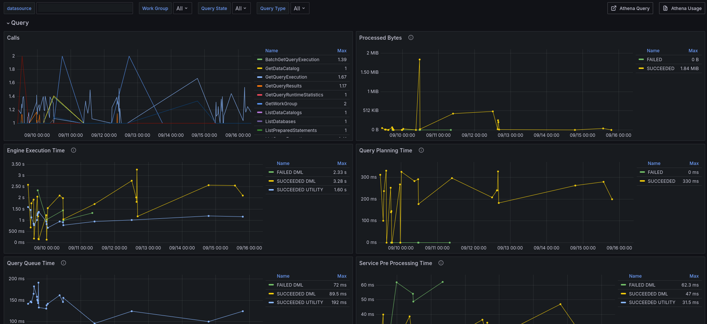](https://github.com/arnaudlemaignen/grafana-dashboards/tree/master/cloudwatch-ds/aws-athena-performances)

### [AWS Bedrock Foundation Models](https://github.com/arnaudlemaignen/grafana-dashboards/tree/master/cloudwatch-ds/aws-bedrock-foundation-models)
Amazon Bedrock is a fully managed service that offers a choice of high-performing foundation models (FMs) and tools to deploy and operate agents.
[](https://github.com/arnaudlemaignen/grafana-dashboards/tree/master/cloudwatch-ds/aws-bedrock-foundation-models)

### [AWS Bedrock GuardRails](https://github.com/arnaudlemaignen/grafana-dashboards/tree/master/cloudwatch-ds/aws-bedrock-guardrails)
Amazon Bedrock Guardrails provides configurable safeguards to help safely build generative AI applications at scale.
[](https://github.com/arnaudlemaignen/grafana-dashboards/tree/master/cloudwatch-ds/aws-bedrock-guardrails)

### [AWS Elasticache Redis](https://github.com/arnaudlemaignen/grafana-dashboards/tree/master/cloudwatch-ds/aws-elasticache-redis)
Amazon ElastiCache is a web service that makes it easy to set up, manage, and scale a distributed in-memory data store or cache environment in the cloud.
[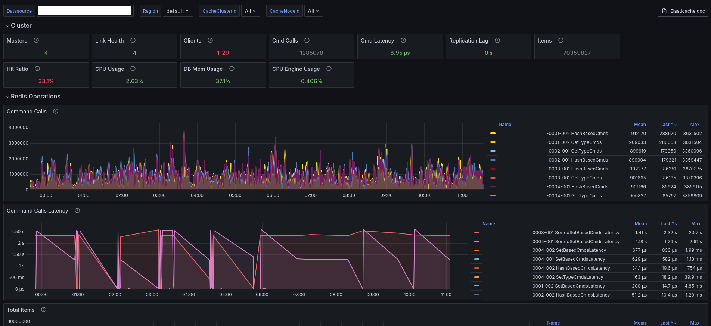](https://github.com/arnaudlemaignen/grafana-dashboards/tree/master/cloudwatch-ds/aws-elasticache-redis)

### [AWS FSx](https://github.com/arnaudlemaignen/grafana-dashboards/tree/master/cloudwatch-ds/aws-fsx)
Amazon FSx makes it easy and cost effective to launch, run, and scale feature-rich, high-performance file systems in the cloud.
[](https://github.com/arnaudlemaignen/grafana-dashboards/tree/master/cloudwatch-ds/aws-fsx)

### [AWS Glue](https://github.com/arnaudlemaignen/grafana-dashboards/tree/master/cloudwatch-ds/aws-glue)
AWS Glue is a serverless data integration service that makes it easy for analytics users to discover, prepare, move, and integrate data from multiple sources.
[](https://github.com/arnaudlemaignen/grafana-dashboards/tree/master/cloudwatch-ds/aws-glue)

### [AWS MSK](https://github.com/arnaudlemaignen/grafana-dashboards/tree/master/cloudwatch-ds/aws-msk)
Amazon Managed Streaming for Apache Kafka (Amazon MSK) is a streaming data service that manages Apache Kafka infrastructure and operations, making it easier for developers and DevOps managers to run Apache Kafka applications and Apache Kafka Connect connectors on AWS—without becoming experts in operating Apache Kafka.
[](https://github.com/arnaudlemaignen/grafana-dashboards/tree/master/cloudwatch-ds/aws-msk)

### [AWS S3](https://github.com/arnaudlemaignen/grafana-dashboards/tree/master/cloudwatch-ds/aws-s3)
Amazon Simple Storage Service (S3) is a service offered by Amazon Web Services (AWS) that provides object storage through a web service interface.
[](https://github.com/arnaudlemaignen/grafana-dashboards/tree/master/cloudwatch-ds/aws-s3)


## Contributions
Pull requests, comments and suggestions are welcome.
